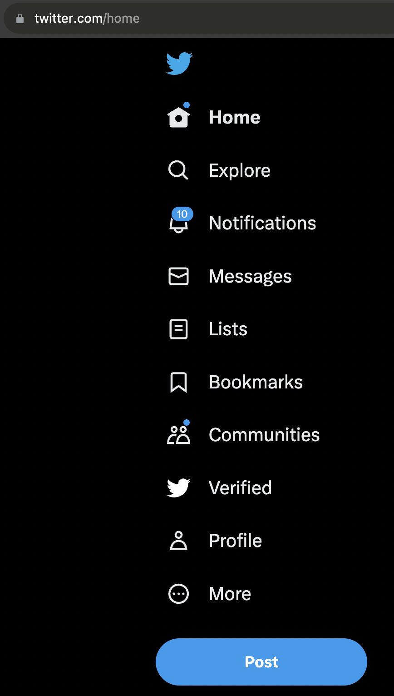

# Twitter Original

Remove 𝕏 from 𝕏 and bring the blue bird back to me!

## How to use

1. Hit the `green button` for download as ZIP.
2. Open Google Chrome and go to `Extension page`.
3. Select `Developer mode` on top right.
4. Click the `Load unpacked` button
5. Find the folder you downloaded and give it a tap.
6. There you have it! Your trusty blue bird will be fluttering back to your side.

Now it's all about enjoying the tweetin' with your feathered friend! 🐦✨

